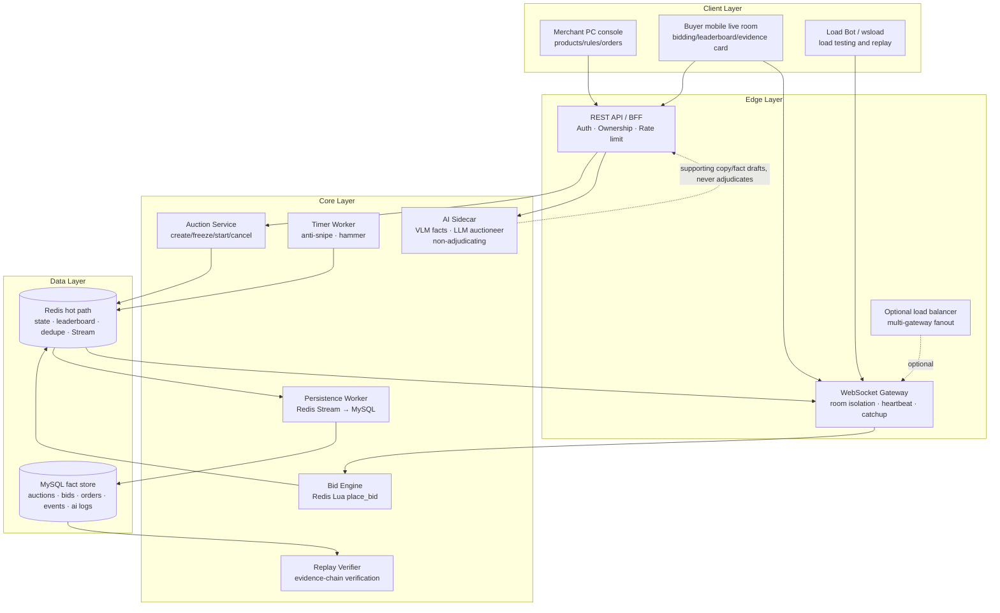
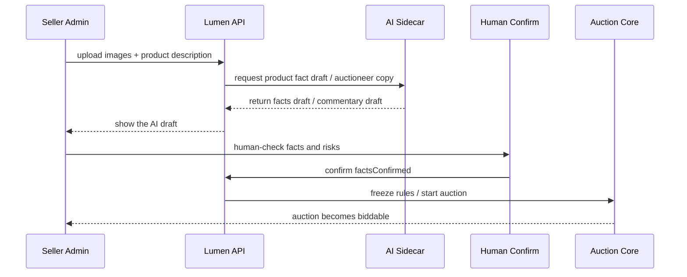

# Lumen Auction Official Submission Material Pack

> Purpose: a ready-to-copy draft for #234 "Official demo submission material checklist" — usable directly in the submission form, the README, or the pitch deck.
> Scope: it only organizes existing project facts and wording; it adds no code behaviour. Before the final submission, refresh the deployment link, demo video link, and member information.

---

## 1. Project title

**Live-Streaming Auction Full-Stack System (Lumen Auction)**

One-line positioning: Lumen Auction is a real-time live-streaming auction system for high-value non-standardized goods, covering the full loop from seller listing, AI-assisted fact confirmation, rule freezing, real-time bidding, anti-snipe extension, hammer settlement, to evidence-chain verification.

---

## 2. Team name and members

> Each member fills in their real name, school, major, and role before submission.

| Member | School / Major | Primary role | Modules owned |
|---|---|---|---|
| TBD | TBD | Frontend / product experience | Buyer live room, merchant console, evidence card, demo interactions |
| TBD | TBD | Backend / real-time systems | Redis Lua adjudication, WebSocket gateway, Timer Worker, MySQL projection |
| TBD | TBD | AI / deployment / testing | AI sidecar, load testing, deployment scripts, demo materials |

---

## 3. Division of work

The project splits collaboration into "user experience layer, real-time auction kernel, AI sidecar and engineering verification".

- **Frontend and product experience**: the mobile live auction room, the bid panel, auction terms, leaderboard, hammer page, evidence card, and the merchant product console. The goal is for a judge to understand within 30 seconds how a buyer joins, bids, waits for the hammer, and verifies the result.
- **Real-time auction backend**: the WebSocket gateway, Redis Lua atomic bidding, Redis Stream as the event source, the anti-snipe Timer Worker, and the MySQL projection for orders and the evidence chain. The goal is that price, winner, sequence number, and hammer outcome stay adjudicable and replayable under concurrent bidding.
- **AI and engineering verification**: the AI sidecar's product-fact drafting and auctioneer copy, while guaranteeing AI never participates in bid adjudication. It also covers local and public-internet load tests, the Replay Verifier, deployment preflight, chaos drills, and assembling the submission materials.

---

## 4. Core feature list

1. **Real-time live auction room**: after entering the room a buyer sees the current price, countdown, leader, recent bids, popularity, and AI host commentary, and bids through HTTP / WebSocket bid commands.
2. **Redis Lua atomic adjudication**: every valid bid is validated by one backend Lua script covering amount, state, time, bid increment ladder, cap price, and the idempotency key, guaranteeing a monotonic `seq` with no gaps under concurrency.
3. **Anti-snipe extension and automatic hammer**: a valid bid inside the last 10 seconds extends the auction automatically; when time is up the Timer Worker produces the SOLD / NO_BID / CANCELLED terminal event.
4. **Merchant product console**: a seller can create a product, upload images, write a description, set the start price / increment ladder / cap price / duration, confirm the AI-extracted facts, and start the auction.
5. **AI sidecar assists but never adjudicates**: AI drafts product facts, auctioneer copy, and atmosphere prompts; bid acceptance, price, winner, and hammer are always decided by the backend state machine.
6. **Evidence chain and Replay Verifier**: every auction produces a replayable event stream plus an HMAC hash chain; the evidence card shows the chain head and event sequence, and the Replay Verifier can recompute the chain and locate where it breaks.
7. **Public 10k-scale load-test evidence**: a real public-internet Tier-2 load test verified correct settlement at 10,000 concurrent connections with `seqGap=0`; the 20,000 storm run explicitly exposed the single-gateway capacity boundary and produced a graceful-degradation improvement roadmap.

---

## 5. End-to-end user flow

In the auction hall a buyer can browse live, upcoming, and finished auctions. On entering a room the frontend first pulls a server snapshot, then joins over WebSocket and resumes events from `lastSeq`. After reading the auction terms the buyer can bid; the frontend mints a `clientBidId` per bid and submits it through the HTTP command channel or the WebSocket fallback. The backend Redis Lua script atomically validates the bid and writes to the Redis Stream, and the gateway broadcasts `BID_ACCEPTED`, `BID_REJECTED`, or `ROOM_STATE_PATCH` to everyone in the room. A valid bid in the last 10 seconds makes the Timer Worker extend the auction, blocking buzzer-beater snipes. Once the auction ends the system produces the terminal event, and buyer and seller can open the evidence card to see the final price, winner, event sequence, and hash-chain verification result.

---

## 6. Live demo links

> Replace with the final deployment address before submission.

- Live demo: `TBD: https://...`
- Backup recording: `TBD: public video link / Feishu link / cloud-drive link`
- Trial accounts: if login is enabled, provide one buyer and one seller trial account; if dev-login is used, state clearly in the submission notes that "the demo environment creates virtual identities automatically".

---

## 7. Demo video script (3 minutes suggested)

### 0:00–0:20 Positioning

> This is a real-time live-streaming auction system for high-value single items. It is not an ordinary product detail page, nor a UI-only demo; the core is real-time bidding, atomic adjudication, anti-snipe hammering, and a replayable evidence chain. AI only provides supporting commentary and fact drafts — it does not decide the price or the winner.

### 0:20–0:55 Seller publishes an auction

Show the merchant console: create a product, upload images, write the description, set the start price, fixed increment, cap price, and duration. Explain that AI can extract a product-fact draft, but the seller must confirm it manually before rules can be frozen and the auction started.

### 0:55–1:45 Buyer bids in real time

Show a buyer entering the live room: current price, countdown, leader, recent bids, popularity, AI host commentary, and auction terms. Use two browsers or two phones to bid simultaneously: one side bids, the other sees the price change and leaderboard update instantly. Emphasize that adjudication is Redis Lua atomic on the backend and the frontend only renders server results.

### 1:45–2:15 Anti-snipe and hammer

Show a valid bid in the last 10 seconds triggering an extension; when the countdown ends the auction enters SOLD / NO_BID / CANCELLED. Explain that the Timer Worker is the sole expiry adjudicator, and neither the video feed nor the AI copy is a source of truth.

### 2:15–2:45 Evidence chain and replay verification

Open the evidence card and show the event sequence, hammer price, winner, and chain-head hash. Then show the Replay Verifier or the broken-chain preview, explaining that the system can recompute the event chain and detect tampering or missing events.

### 2:45–3:00 Engineering performance and wrap-up

Show the public load-test summary: 10,000 concurrent connections all green, `seqGap=0`, and the 20,000 storm run exposing the single-gateway capacity boundary. Wrap up: the project has both a complete business loop and honest engineering boundaries with a follow-up scaling plan.

---

## 8. Source repository link

- Main repository: `https://github.com/Eliaaazzz/live-auction-system`
- Recommended submission branch: `main` or the final freeze branch (add the final commit SHA before submitting)
- Key directories:
  - `apps/lumen/`: Go backend, WebSocket, Lua adjudication, Timer, Persistence, Verifier.
  - `apps/web/`: React frontend, buyer live room, merchant console, evidence card.
  - `apps/ai-sidecar/`: the AI sidecar capabilities.
  - `proto/`: protocol, data, and state-machine contracts.
  - `docs/`: architecture, reports, demo, load tests, and runbooks.
  - `infra/`: Docker Compose, MySQL schema, Redis config, and deployment helpers.

---

## 9. README / run instructions summary

### Local startup

```bash
cp .env.example .env
docker compose -f infra/docker-compose.yml up -d --build
```

### Common checks

```bash
# Go backend checks
go test ./apps/lumen/...

# Frontend checks
cd apps/web
npm test
npm run build

# WebSocket / room smoke tests
npm run smoke:all
```

### Multi-gateway demo

```bash
docker compose -f infra/docker-compose.yml --profile multigw up -d --build
cd apps/web
npm run smoke:multigw
```

The multi-gateway demo proves the gateway is stateless: two WebSocket gateway instances subscribe to the same Redis backbone, and a bid adjudicated through gateway A is broadcast with the same `seq` to a client connected to gateway B.

---

## 10. System architecture diagram



Key boundaries: Redis is the real-time hot path; MySQL is the fact and audit store; Pub/Sub is only a wake-up channel and the authoritative event source is the Redis Stream; the AI sidecar can degrade or go offline and can never decide the bid, price, winner, or time.

---

## 11. LLM / AI capability notes

The project's AI capability uses a **sidecar design** (a separate process, `apps/ai-sidecar`, with three endpoints: `/facts/draft` for VLM fact extraction, `/llm/auctioneer` for host copy, `/llm/recommend` for pricing suggestions). AI is not on the auction adjudication path — it neither reads nor writes price, winner, or terminal adjudication — and only provides explainable, switchable-off assistance.

### Models and integration

- **Primary model: Doubao (Volcengine Ark)** — ByteDance's own LLM, matching the challenge's own stack. `doubao-vision` handles multimodal product-image fact extraction and the `doubao` text model writes auctioneer commentary.
- **Unified OpenAI-compatible adapter** (`apps/ai-sidecar/internal/llm`): it calls Ark's `/api/v3/chat/completions`. The same code can point at a **self-hosted open-source model** (Ollama / vLLM running Qwen2.5, which covers the optional "open-source model integration" item) or any OpenAI-compatible gateway just by changing the `*_BASE_URL/*_MODEL` environment variables — no code change.
- **Prompt design**: the VLM uses "a system instruction pinning the JSON output schema + seller text passed as a DATA block outside the trust boundary" as **injection defence** (an "ignore previous instructions" inside a seller description is treated purely as data and cannot change the schema); auctioneer copy uses a system prompt of "a single sentence, no amounts/URLs/phone numbers/banned words" to keep the output inside the compliance band.
- **Integration switch (mock by default, runs with zero keys)**: setting `ARK_API_KEY` plus the inference endpoint ids (`ARK_VLM_MODEL`/`ARK_LLM_MODEL`) flips from canned responses to the real model; without them the sidecar falls back to deterministic canned copy and the demo path stays complete. `/llm/recommend` deliberately keeps a **deterministic heuristic** (explainable, and it stops the model hallucinating a price).

### AI capability 1: product fact draft

After the seller uploads product images and a description, the AI sidecar can generate a product-fact draft such as name, category, visible features, and risk notes. The seller must confirm these facts manually before the auction can be frozen and started. This speeds up merchant data entry while preventing AI from auto-generating unconfirmed product claims.

### AI capability 2: auctioneer copy

The AI host copy in the live room explains the current price, popularity, leader changes, and auction status. For example it produces a "dark-horse bid" prompt when the price climbs fast, or reminds buyers about the countdown and anti-snipe rule as the auction nears its end. This copy only affects presentation and never enters backend adjudication.

### AI capability 3: logging and audit

AI inputs and outputs can be recorded into `ai_usage_logs` for reviewing model usage scenarios, human review status, and demo materials. Worth emphasizing in the submission: AI is a module that enhances experience and explainability, not a single point the system's correctness depends on.

### AI safety boundary

- AI does not execute `place_bid`.
- AI does not modify Redis hot-path keys.
- AI does not decide `currentPriceCents`, `winnerId`, `endAtMs`, or terminal events.
- **Two-layer guardrail + canned fallback**: model output first passes a compliance filter (length/URL/phone/amount/banned words), then the backend independently re-checks it; any failure (timeout / rate limit / bad JSON / violation) swaps in deterministic canned copy. When AI copy fails, the auction keeps running on the backend state machine.

---

## 12. Key engineering challenges and solutions

### Challenge 1: 10k-scale real-time auction broadcast

The pressure in a live auction concentrates on a large number of long-lived connections in one room with high-frequency price changes, so you cannot simply broadcast every bid to everyone in full. The system uses WebSocket room isolation, the Redis Stream as authoritative event source, Pub/Sub as the wake-up channel, and `ROOM_STATE_PATCH` to coalesce broadcasts in large rooms. The bidder still gets an immediate ack, while spectators receive a coalesced price state, reducing the broadcast storm.

**Payoff**: in the public Tier-2 load test, the 10,000-connection scenario settled correctly with `seqGap=0`, showing that the broadcast optimization did not sacrifice event correctness.

### Challenge 2: consistency and idempotency under concurrent bidding

A buyer may resubmit the same bid because of a network timeout, a WebSocket reconnect, or an HTTP fallback. The system uses `(auctionId, userId, clientBidId)` as the idempotency key and does the check, adjudication, and event write atomically inside Redis Lua. If the same request is retried, the server replays the first result rather than minting a second `seq` or a duplicate sale.

**Payoff**: the system can safely run the HTTP command channel and the WebSocket fallback side by side without "double-charging on a post-timeout retry across channels".

### Challenge 3: an auditable hammer result

An auction system cannot ask users to simply trust the frontend. The system writes every significant state change as an event and builds an HMAC hash chain in the MySQL projection. The evidence card shows the final price, winner, event sequence, and chain head, and the Replay Verifier can recompute the chain and find where it breaks.

**Payoff**: the hammer result is explainable from the server-side event sequence, which makes it easy for judges to verify and for disputes to be handled later.

### Challenge 4: the public load test exposed the single-gateway capacity boundary

The 10,000-connection scenario already meets the target, but the 20,000 storm scenario crashed and restarted a single gateway at roughly 15.8k connections. Rather than dressing this up as "no problem at all", the team turned it into engineering work: admission control, per-connection memory reduction, GC / pprof forensics, multi-gateway scale-out, and clearer re-test criteria.

**Payoff**: the project materials can show the system's boundary honestly, and explain how going past it turns from a crash cliff into graceful degradation.

---

## 13. Highlights / innovations

### Highlight 1: AI as a sidecar, not a black-box adjudicator

AI handles fact drafts and auctioneer copy while core bid adjudication is done entirely by the backend state machine and Redis Lua. This demonstrates full-stack AI capability while avoiding the compliance risk of letting AI decide price and winner.

### Highlight 2: real-time correctness is provable

Monotonic `seq`, an idempotent `clientBidId`, the Redis Stream, the MySQL projection, and the Replay Verifier turn a real-time auction into a replayable, verifiable event system. Judges see more than a UI: they see an engineering loop that explains "why this person won and why this price is valid".

### Highlight 3: a multi-mode, extensible auction kernel

The project supports more than a plain English auction — it keeps an extension path for pluggable modes such as sealed bid, second-price, prequalify-then-open, and a reserve-price advisor. The architecture separates auction rules, adjudication scripts, and the presentation layer, which makes further extension straightforward.

### Highlight 4: real public load testing and honest engineering boundaries

The project has real public 10k concurrency results and also documents the single-gateway bottleneck under a 20k storm. The submission can emphasize: we did not just build a demo — we know at what pressure the system meets its targets, where it tops out, and how to shed load and scale horizontally next.

---

## 14. Optional bonus materials

### Performance summary

| Scenario | Connection mix | Bid pressure | Result | Key conclusion |
|---|---|---:|---|---|
| 10k baseline | 9900 viewers + 100 bidders | ~500 bids/s | Pass | 10,000 concurrent connections held throughout, auction correctly SOLD, `seqGap=0` |
| 10k high-activity | 6000 viewers + 4000 bidders | ~20,000 bids/s | Pass | Fast reject absorbs the vast majority of doomed bids, correctness preserved |
| 20k storm | 10000 viewers + 10000 bidders | ~50,000 bids/s | Boundary exposed | A single gateway tops out at roughly 15.8k connections; addressed by admission control / multi-gateway scale-out |

### Prompt / agent flow diagram



### User feedback / internal-test log template

| Audience | Scenario | Feedback | Adjustment |
|---|---|---|---|
| TBD | Buyer live room | TBD | TBD |
| TBD | Merchant console | TBD | TBD |
| TBD | Evidence card | TBD | TBD |

---

## Pre-submission replacement checklist

- [ ] Fill in the final demo link.
- [ ] Fill in the demo video link.
- [ ] Fill in team member names / schools / majors / roles.
- [ ] Fill in the final submission commit SHA.
- [ ] Confirm the public load-test report path and final numbers are up to date.
- [ ] Confirm the README quick-start commands match current main.
- [ ] Confirm every "TBD" field has been replaced.
