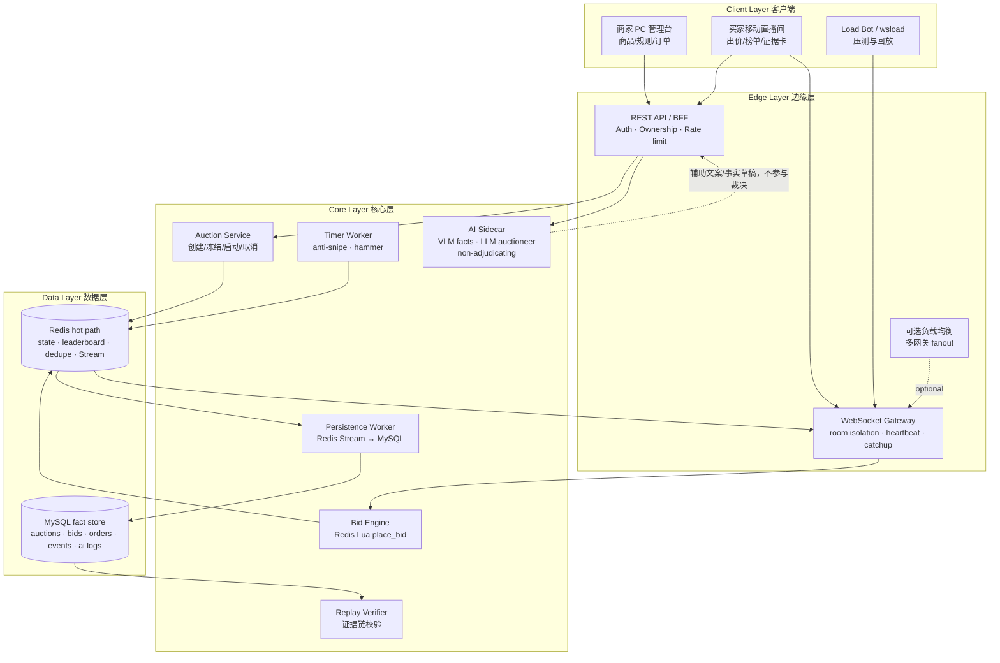
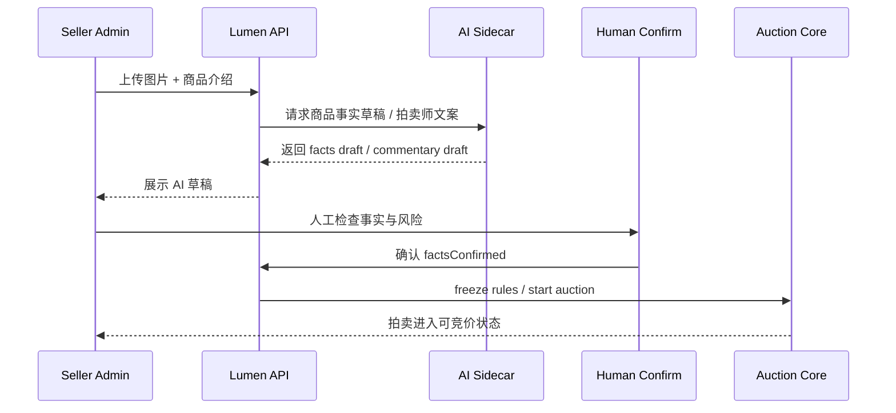

# Lumen Auction 官方成果演示提交材料包

> 用途：给 #234「官方成果演示 DEMO 材料清单」提供一份可直接复制到提交页、README 或演示稿的材料底稿。  
> 范围：只整理项目事实与表达，不新增代码行为；最终提交前请按最新部署链接、演示视频链接、成员信息做一次替换。

---

## 1. 课题名称

**直播竞拍全栈系统（Lumen Auction）**

一句话定位：Lumen Auction 是面向高价值非标品的直播实时竞拍系统，覆盖卖家上架、AI 辅助事实确认、规则冻结、实时出价、反狙击延时、落槌结算和证据链核验的完整闭环。

---

## 2. 团队名称与成员名单

> 提交前由每位成员补全真实姓名、学校、专业与角色。

| 成员 | 学校 / 专业 | 主要角色 | 负责模块 |
|---|---|---|---|
| 待补 | 待补 | 前端 / 产品体验 | 买家直播间、商家管理台、证据卡、Demo 交互 |
| 待补 | 待补 | 后端 / 实时系统 | Redis Lua 裁决、WebSocket 网关、Timer Worker、MySQL 投影 |
| 待补 | 待补 | AI / 部署 / 测试 | AI sidecar、压测、部署脚本、演示材料 |

---

## 3. 分工说明

本项目按「用户体验层、实时竞拍内核、AI 旁路与工程验证」拆分协作。

- **前端与产品体验**：实现移动端直播竞拍房间、出价面板、拍卖须知、排行榜、落槌页、证据卡与商家商品管理台。目标是让评委能在 30 秒内看懂买家如何进入、出价、等待落槌和验证结果。
- **实时竞拍后端**：实现 WebSocket 网关、Redis Lua 原子出价、Redis Stream 事件源、反狙击 Timer Worker、订单和证据链 MySQL 投影。目标是保证并发出价下价格、赢家、序列号和落槌结果可裁决、可回放。
- **AI 与工程验证**：实现 AI sidecar 的商品事实草稿与拍卖师文案能力，同时确保 AI 永不参与出价裁决。配套完成本地和公网压测、Replay Verifier、部署预检、故障演练与提交材料整理。

---

## 4. 核心功能清单

1. **实时直播竞拍房间**：买家进入直播间后可查看当前价、倒计时、领先者、最近出价、热度和 AI 主播讲解，并通过 HTTP / WebSocket 出价命令参与竞拍。
2. **Redis Lua 原子裁决**：所有有效出价由后端 Lua 脚本统一校验金额、状态、时间、加价阶梯、封顶价和幂等键，确保并发下单调 `seq` 无 gap。
3. **反狙击延时与自动落槌**：最后 10 秒内出现有效出价时自动延长竞拍时间；Timer Worker 到点后生成 SOLD / NO_BID / CANCELLED 等终态事件。
4. **商家商品管理台**：卖家可以创建商品、上传图片、填写介绍、设置起拍价 / 加价阶梯 / 封顶价 / 时长、确认 AI 抽取事实并启动拍卖。
5. **AI sidecar 辅助但不裁决**：AI 用于商品事实草稿、拍卖师文案和氛围提示；出价接收、价格、赢家和落槌永远由后端状态机决定。
6. **证据链与 Replay Verifier**：每场拍卖产生可回放事件流和 HMAC 哈希链，证据卡展示链头和事件序列，Replay Verifier 可重算并发现断链位置。
7. **公网万人压测证据**：真公网 Tier-2 压测已验证 10,000 并发连接下系统正确结算，且 `seqGap=0`；20,000 风暴压测明确暴露单网关容量边界并形成 graceful degradation 改进路线。

---

## 5. 端到端使用流程

买家进入竞拍大厅后，可以查看正在直播、即将开始和历史结束的拍卖场次。进入某个直播间后，前端先拉取服务端快照，再通过 WebSocket 加入房间并从 `lastSeq` 继续接收事件。买家阅读拍卖须知后可以参与竞拍，前端为每次出价生成 `clientBidId`，并通过 HTTP 命令道或 WebSocket fallback 提交到后端。后端 Redis Lua 脚本原子校验出价并写入 Redis Stream，网关再把 `BID_ACCEPTED`、`BID_REJECTED` 或 `ROOM_STATE_PATCH` 广播给房间内用户。最后 10 秒内若出现有效出价，Timer Worker 自动延时，防止压哨狙击。竞拍结束后系统生成终态事件，买家和卖家可以进入证据卡查看最终价格、赢家、事件序列和哈希链验证结果。

---

## 6. 在线 Demo 链接

> 提交前替换为最终部署地址。

- 在线 Demo：`待补： https://...`
- 备用录屏：`待补：公开视频链接 / 飞书链接 / 网盘链接`
- 体验账号：如启用登录，请提供买家与卖家各一套体验账号；如使用 dev-login，请在提交说明中明确「演示环境自动创建虚拟身份」。

---

## 7. 演示视频脚本（建议 3 分钟）

### 0:00–0:20 项目定位

> 这是一套直播实时竞拍系统，面向高价值单品。它不是普通商品详情页，也不是只做 UI 的 demo；核心是实时出价、原子裁决、反狙击落槌和可回放证据链。AI 只做辅助讲解和事实草稿，不决定价格和赢家。

### 0:20–0:55 商家端发布拍卖

展示商家管理台：新建商品、上传图片、填写介绍、设置起拍价、固定加价、封顶价和时长。说明 AI 可以抽取商品事实草稿，但卖家必须人工确认后才能冻结规则并启动拍卖。

### 0:55–1:45 买家端实时竞拍

展示买家进入直播间：当前价、倒计时、领先者、最近出价、热度、AI 主播讲解和拍卖须知。用两个浏览器或两台手机演示同时出价：一端出价，另一端同步看到价格变化和排行榜更新。强调后端用 Redis Lua 原子裁决，前端只展示服务端结果。

### 1:45–2:15 反狙击与落槌

展示最后 10 秒有效出价触发延时；倒计时结束后进入 SOLD / NO_BID / CANCELLED 终态。说明 Timer Worker 是唯一到期裁决者，视频画面和 AI 文案都不是裁决来源。

### 2:15–2:45 证据链与回放校验

进入证据卡，展示事件序列、落槌价、赢家和链头哈希。再展示 Replay Verifier 或断链预览，说明系统能重算事件链并发现篡改或缺失事件。

### 2:45–3:00 工程性能与总结

展示公网压测摘要：10,000 并发连接全绿，`seqGap=0`，20,000 风暴压测暴露单网关容量边界。总结：项目既有完整业务闭环，也有真实工程边界和后续扩展方案。

---

## 8. 源代码仓库链接

- 主仓库：`https://github.com/Eliaaazzz/live-auction-system`
- 推荐提交分支：`main` 或最终 freeze 分支（提交前补最终 commit SHA）
- 关键目录：
  - `apps/lumen/`：Go 后端、WebSocket、Lua 裁决、Timer、Persistence、Verifier。
  - `apps/web/`：React 前端、买家直播间、商家管理台、证据卡。
  - `apps/ai-sidecar/`：AI 旁路能力。
  - `proto/`：协议、数据和状态机契约。
  - `docs/`：架构、报告、演示、压测与运行手册。
  - `infra/`：Docker Compose、MySQL schema、Redis 配置和部署辅助。

---

## 9. README / 运行说明摘要

### 本地启动

```bash
cp .env.example .env
docker compose -f infra/docker-compose.yml up -d --build
```

### 常用验证

```bash
# Go 后端检查
go test ./apps/lumen/...

# 前端检查
cd apps/web
npm test
npm run build

# WebSocket / 房间冒烟
npm run smoke:all
```

### 多网关演示

```bash
docker compose -f infra/docker-compose.yml --profile multigw up -d --build
cd apps/web
npm run smoke:multigw
```

多网关演示用于证明网关无状态：两个 WebSocket 网关实例订阅同一 Redis backbone，一笔经网关 A 裁决的出价，连在网关 B 的客户端也会收到相同 `seq` 的广播。

---

## 10. 系统架构图



关键边界：Redis 是实时热路径；MySQL 是事实和审计存储；Pub/Sub 只做唤醒，权威事件源是 Redis Stream；AI sidecar 可以降级或下线，不能决定出价、价格、赢家和时间。

---

## 11. 大模型 / AI 能力使用说明

本项目的 AI 能力采用 **sidecar 旁路设计**（独立进程 `apps/ai-sidecar`，三端点：`/facts/draft` VLM 事实抽取、`/llm/auctioneer` 主播文案、`/llm/recommend` 定价建议）。AI 不在竞拍裁决链路内，不读取或写入价格、赢家和终态裁决，只提供可解释、可下线的辅助能力。

### 模型与接入方式

- **主用模型：豆包 Doubao（火山方舟 Volcengine Ark）** —— 字节自家大模型，与本赛题同源。`doubao-vision` 多模态做商品图事实抽取，`doubao` 文本模型做拍卖师解说。
- **统一 OpenAI 兼容适配器**（`apps/ai-sidecar/internal/llm`）：调用 Ark `/api/v3/chat/completions`。同一份代码、仅换 `*_BASE_URL/*_MODEL` 环境变量即可指向**自托管开源模型**（Ollama / vLLM 跑 Qwen2.5，对应「开源模型调用」可选项）或任何 OpenAI 兼容网关——无需改代码。
- **Prompt 方案**：VLM 用「系统指令固定 JSON 输出 schema + 卖家文本作为受信任边界外的 DATA 分隔块」做**注入防御**（卖家描述里的「ignore previous instructions」只被当数据、不改 schema）；主播文案用「单句中文、禁金额/网址/电话/违规词」系统提示，把模型输出约束在合规带内。
- **接入开关（默认 mock，零 key 可跑）**：设 `ARK_API_KEY` + 推理接入点 id（`ARK_VLM_MODEL`/`ARK_LLM_MODEL`）即从罐头切到真模型；未配置时 sidecar 自动回退确定性罐头文案，演示路径完整。`/llm/recommend` 定价建议**有意保留确定性启发式**（可解释、不让模型幻觉报价）。

### AI 能力 1：商品事实草稿

卖家上传商品图片和介绍后，AI sidecar 可以生成商品事实草稿，例如名称、类别、可见特征和风险提示。卖家必须人工确认这些事实后，拍卖才能进入冻结和启动流程。这样既提高商家录入效率，也避免 AI 自动生成未经确认的商品承诺。

### AI 能力 2：拍卖师文案

直播间中的 AI 主播文案用于解释当前价格、热度、领先者变化和竞拍状态。例如当价格快速上升时生成「黑马出价」类提示；当竞拍接近结束时提醒买家注意倒计时和反狙击规则。该文案只影响展示，不参与后端裁决。

### AI 能力 3：日志与审计

AI 输入输出可记录到 `ai_usage_logs`，用于复盘模型使用场景、人工审核状态和演示材料。提交时建议强调：AI 是增强体验和解释性的模块，不是系统正确性的唯一依赖。

### AI 安全边界

- AI 不执行 `place_bid`。
- AI 不修改 Redis 热路径 key。
- AI 不决定 `currentPriceCents`、`winnerId`、`endAtMs` 或终态事件。
- **双层 guardrail + 罐头兜底**：模型输出先过合规过滤（长度/网址/电话/金额/违规词），后端再独立复检一遍；任意失败（超时/限流/坏 JSON/违规）即换确定性罐头文案。AI 文案失败时，竞拍仍按后端状态机继续运行。

---

## 12. 关键工程难点与解决方案

### 难点 1：万人级实时竞拍广播

直播竞拍的压力集中在同一房间的大量长连接和高频价格变化，不能简单把每次出价全量广播给所有人。系统采用 WebSocket room 隔离、Redis Stream 权威事件源、Pub/Sub 唤醒和 `ROOM_STATE_PATCH` 大房间合并广播。这样直接出价者能立刻收到 ack，旁观者则收到合并后的价格状态，减少广播风暴。

**解决收益**：公网 Tier-2 压测中，10,000 并发连接场景正确结算，`seqGap=0`，说明广播优化没有牺牲事件正确性。

### 难点 2：并发出价下的一致性与幂等

买家可能因为网络超时、WebSocket 重连或 HTTP fallback 重复提交同一出价。系统用 `(auctionId, userId, clientBidId)` 做幂等键，并在 Redis Lua 中原子检查、裁决和写入事件。如果同一请求重试，服务端回放第一次结果，不会产生第二个 `seq` 或重复成交。

**解决收益**：系统可以安全支持 HTTP 命令道和 WebSocket fallback 共存，避免超时后“双通道重试双扣”。

### 难点 3：落槌结果可审计

竞拍系统不能只让用户相信前端画面。系统将每个重要状态变化写成事件，并在 MySQL 投影中生成 HMAC 哈希链。证据卡展示最终价格、赢家、事件序列和链头，Replay Verifier 可重新计算链并发现断链位置。

**解决收益**：落槌结果可由服务端事件序列解释，方便评委验证，也方便后续处理争议。

### 难点 4：公网压测暴露单网关容量边界

10,000 并发场景已经达标，但 20,000 风暴场景让单台网关在约 15.8k 连接处崩溃重启。团队没有把这个包装成“完全没问题”，而是转化为工程改进：准入控制、单连接内存削减、GC / pprof 取证、多网关扩展和更清晰的复测标准。

**解决收益**：项目材料能诚实展示系统边界，并说明超过边界时如何从 crash cliff 变成 graceful degradation。

---

## 13. 项目亮点 / 创新点

### 亮点 1：AI 旁路，而不是 AI 黑箱裁决

AI 负责事实草稿和拍卖师文案，核心出价裁决完全由后端状态机和 Redis Lua 完成。这既展示 AI 全栈能力，又避免用 AI 决定价格和赢家带来的合规风险。

### 亮点 2：实时正确性可证明

系统用单调 `seq`、幂等 `clientBidId`、Redis Stream、MySQL 投影和 Replay Verifier 将实时竞拍变成可重放、可校验的事件系统。评委看到的不只是 UI，而是可以解释“为什么这个人赢、为什么这个价格有效”的工程闭环。

### 亮点 3：多模式与可扩展拍卖内核

项目不只支持普通英式竞拍，还保留可插拔模式扩展路径，如暗拍、二价、资格预审到正式明拍、保留价顾问等。系统架构把拍卖规则、裁决脚本和展示层分开，便于继续扩展。

### 亮点 4：真实公网压测与工程边界

项目有真实公网 10k 并发压测结果，也记录了 20k 风暴下的单网关瓶颈。提交材料可以强调：我们不仅做出 demo，还知道系统在什么压力下达标、在哪里触顶、下一步如何降载和横向扩展。

---

## 14. 可选加分材料

### 性能指标摘要

| 场景 | 连接构成 | 出价压力 | 结果 | 关键结论 |
|---|---|---:|---|---|
| 10k 基线 | 9900 观众 + 100 出价者 | 约 500 bids/s | 通过 | 10,000 并发全程保持，拍卖正确 SOLD，`seqGap=0` |
| 10k 高活跃 | 6000 观众 + 4000 出价者 | 约 20,000 bids/s | 通过 | fast reject 吸收绝大多数注定失败出价，正确性保持 |
| 20k 风暴 | 10000 观众 + 10000 出价者 | 约 50,000 bids/s | 暴露边界 | 单网关在约 15.8k 连接触顶，后续通过 admission control / 多网关扩展解决 |

### Prompt / Agent 流程图



### 用户反馈 / 内测记录模板

| 反馈对象 | 场景 | 反馈 | 调整 |
|---|---|---|---|
| 待补 | 买家直播间 | 待补 | 待补 |
| 待补 | 商家管理台 | 待补 | 待补 |
| 待补 | 证据卡 | 待补 | 待补 |

---

## 提交前替换清单

- [ ] 补最终 Demo 链接。
- [ ] 补演示视频链接。
- [ ] 补团队成员姓名 / 学校 / 专业 / 角色。
- [ ] 补最终提交 commit SHA。
- [ ] 确认公网压测报告路径和最终数字是否更新。
- [ ] 确认 README 的快速启动命令与当前 main 一致。
- [ ] 确认所有“待补”字段已替换。
